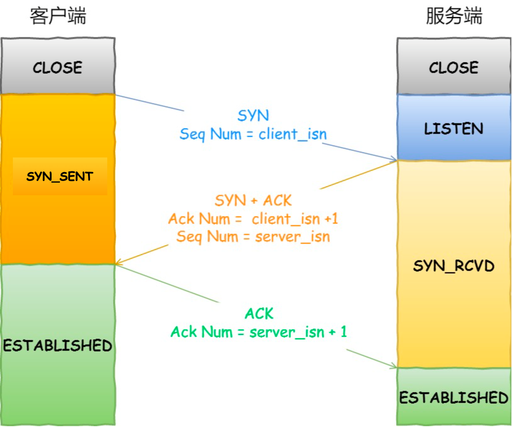
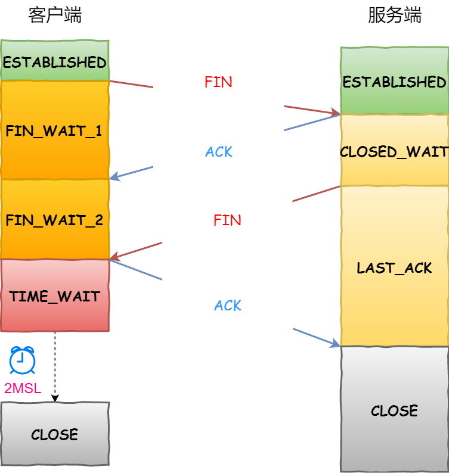

# 使用gopacket抓TCP三次握手四次挥手

gopacket是一个抓包工具，可以让我们不用命令行而是用Go代码来进行抓包、包模拟、包解析等功能。

## Example

本节提供一个例子来说明如何使用gopacket抓TCP三次握手四次挥手

```shell
cd content/《Go技巧》/content/使用gopacket抓TCP三次握手四次挥手/example/tcptest
go mod tidy
sudo go run main.go #启动抓包
#启动另一个终端执行
go run tcpserver/main.go
#再启动另一个终端执行
go run tcpclient/main.go
```

可以看到抓包显示的内容
```shell
2023/12/18 17:03:53 开始监听lo网络接口的tcp报文
tcp报文 | 127.0.0.1:48604-->127.0.0.1:8079 | SYN: true, ACK: false, FIN: false | 序列号: 826795163, 确认应答号: 0 | payload: 
tcp报文 | 127.0.0.1:8079-->127.0.0.1:48604 | SYN: true, ACK: true, FIN: false | 序列号: 2753825882, 确认应答号: 826795164 | payload: 
tcp报文 | 127.0.0.1:48604-->127.0.0.1:8079 | SYN: false, ACK: true, FIN: false | 序列号: 826795164, 确认应答号: 2753825883 | payload: 
#以上是三次握手
tcp报文 | 127.0.0.1:48604-->127.0.0.1:8079 | SYN: false, ACK: true, FIN: false | 序列号: 826795164, 确认应答号: 2753825883 | payload: hello world
tcp报文 | 127.0.0.1:8079-->127.0.0.1:48604 | SYN: false, ACK: true, FIN: false | 序列号: 2753825883, 确认应答号: 826795175 | payload: 
#以上是数据报文及确认报文
tcp报文 | 127.0.0.1:48604-->127.0.0.1:8079 | SYN: false, ACK: true, FIN: true | 序列号: 826795175, 确认应答号: 2753825883 | payload: 
tcp报文 | 127.0.0.1:8079-->127.0.0.1:48604 | SYN: false, ACK: true, FIN: true | 序列号: 2753825883, 确认应答号: 826795176 | payload: 
tcp报文 | 127.0.0.1:48604-->127.0.0.1:8079 | SYN: false, ACK: true, FIN: false | 序列号: 826795176, 确认应答号: 2753825884 | payload:
#以上是四次/三次？挥手报文
```

## 先说三次握手

* 一开始，服务端和客户端都处于`CLOSE`状态，服务端调用`listen()`开始监听某个端口后，进入`LISTEN`状态
* 首先由客户端发起建立连接的请求，客户端会生成随机初始化序号(例子中的826795163)，并将`SYN`置为`true`,发送建连请求给服务端，客户端进入`SYN_SENT`状态
* 服务端收到请求，会把`ACK`和`SYN`置为`true`，并随机初始化服务端的序列号(例子中的2753825882)，并把`客户端发来的客户端序列号+1`(例子中的826795164)，写入确认应答号，服务端进入`SYN_RCVD`状态
* 客户端收到服务器的确认和建连请求，回复`ACK`，并把`服务端发来的服务端序列号+1`(例子中的2753825883)写入确认应答号，客户端进入`ESTABLISHED`状态
* 服务端收到报文后也进入`ESTABLISHED`状态

## 然后看发送数据

发送数据需要两个报文，一个是数据报文，一个是确认报文
* 本例中是客户端主动向服务端发送数据，发送时将使用当前的客户端服务端序列号，并将`ACK`置为置为`true`
* 服务端收到数据后需要回复`ACK`，并把客户端发来的序列号+1，写入确认应答号。

## 四次挥手

* 一开始客户端调用`Close()`，主动发起断开请求，会发送`FIN`报文，两端序号不动，进入`FIN_WAIT_1`状态，此时客户端只是不发送数据了，但还可以接收数据
* 服务器收到请求，会回复`ACK`报文，并把客户端发来的序列号+1写入确认应答号，服务端进入`CLOSE_WAIT`状态，此时服务器可能还有需要处理和发送的数据
* 客户端收到`ACK`报文，进入`FIN_WAIT_2`状态
* 服务器处理完数据后，发送`FIN`报文，两端序号不动，之后服务端进入`LAST_ACK`状态
* 客户端收到报文后，回复`ACK`报文，并把服务端发来的序列号+1,进入`TIME_WAIT`状态
* 服务端收到`ACK`报文后，进入`CLOSE`状态
* 客户端在经过`2MSL`时间后，也进入`CLOSE`状态

但是上面的例子中，看到只有三次挥手

这里需要明白`TCP的延迟确认机制`

TCP的延迟确认机制是为了增强性能，一个不携带数据的ACK包也是需要40字节的大小的。所以为了能少发ACK，可以把ACK和数据一起发送。延迟确认就是本来要发ACK了，但是我等200ms，看没有数据了我才发，有的话我就连着数据一起发。

本例这边，服务端回复了ACK后，发现自己没有什么要处理的数据了，就直接回复FIN了，但此时ACK还在延迟，就带着FIN一起了。

TCP延迟确认是默认开启的，所以经常看到三次挥手的现象。
