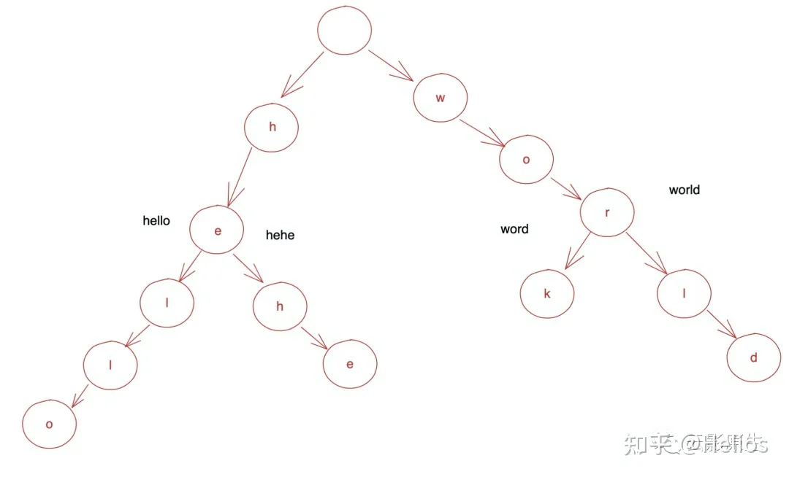
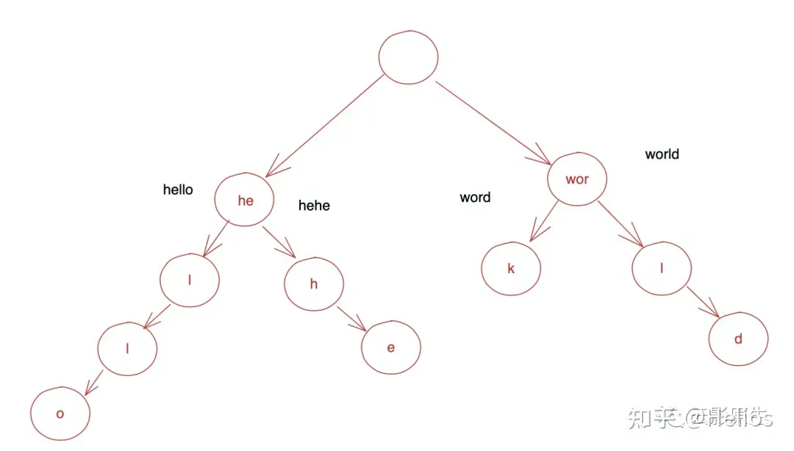
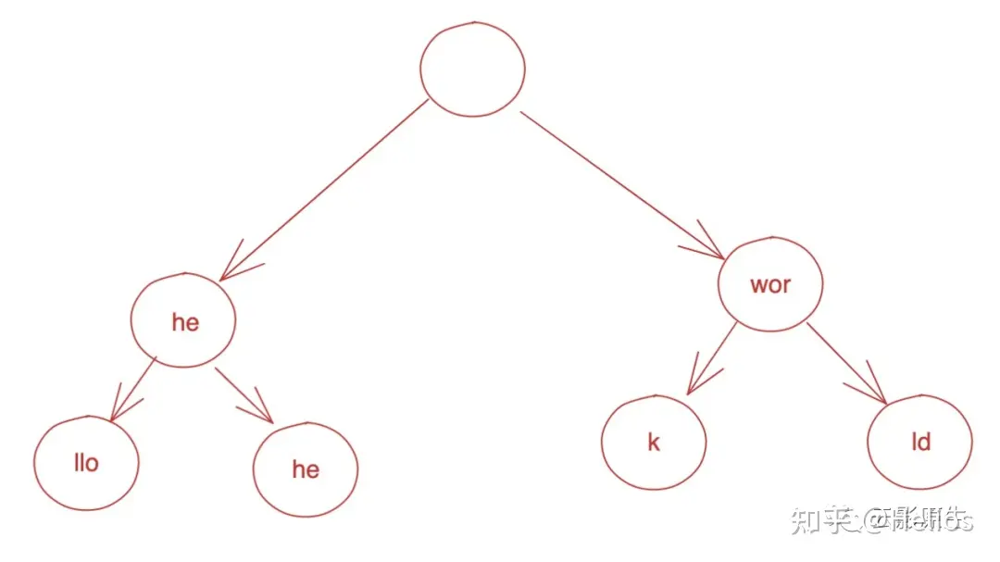

# go-immutable-radix

# 1. 安装

```go
go get github.com/hashicorp/go-immutable-radix/v2
```

# 2. radix

`radix tree` （基数树）也被称为Trie tree（字典树），在这种树结构中，每个节点的子节点的数量取决于键的长度。可以在时间复杂度为O(k)的情况下（k为键的长度）进行插入、删除和查找操作。

很多地方都使用了基数树，比如redis中存储slot对应的key信息，大多数http的router等。

对于immutable radix tree（不可变基数树），每次插入或删除操作都会生成一个新的树，而不会修改原始树。这种不可变性质使得并发操作更容易，也提供了某些优化和功能。

以下内容转自https://zhuanlan.zhihu.com/p/404700132

现在来思考这样一个问题，一个单词本能够插入很多个单词，然后给定一个单词，查看已有的单词表中是否有给定单词前缀相同的单词。比如：

1、 插入hello

2、 插入hehe

3、 插入work

4、 插入world

5、 查询he YES

6、 查询woo NO

就可以使用字典树来解决这个问题



此时，查找速度与树的高度有关，树的高度其实等于最长的单词长度，并且由于每个节点最多有26各字母，所以查询的复杂度就是O(26*最长单词长度)

这里是可以进一步优化的

可以发现hello和hehe有共同的前缀，所以其实可以把它们合并



还可以继续优化的，因为查找到he后，就只能查找llo或者he了



所以合并的原则是如果树中的一个节点是父节点的唯一子节点，那么该子节点将会和父节点合并。

# 3. 使用
提供了示例代码
```shell
cd content/《Go第三方库》/content/go-immutable-radix/example
go mod tidy
go run main.go
```

一图流使用说明：
```go
package main

import (
	"fmt"

	iradix "github.com/hashicorp/go-immutable-radix/v2"
)

func main() {
	r := iradix.New[int]()
	r, _, _ = r.Insert([]byte("foo"), 1)
	r, _, _ = r.Insert([]byte("fooaa"), 2)
	r, _, _ = r.Insert([]byte("fooaabb"), 3)
	fmt.Println(r.Get([]byte("fooaa")))                   //输出2
	s, i, e := r.Root().LongestPrefix([]byte("fooaa123")) //输出2, 因为最长前缀匹配到了fooaa
	fmt.Println(string(s), i, e)
	s, i, e = r.Root().Maximum()
	fmt.Println(string(s), i, e) //输出3, 因为fooaabb是key最长的
	it := r.Root().Iterator()
	it.SeekPrefix([]byte("fooa")) //将指针定到fooa前缀
	for key, _, ok := it.Next(); ok; key, _, ok = it.Next() {
		fmt.Println("===", string(key))
	}
	// 输出
	// === fooaa
	// === fooaabb
	it = r.Root().Iterator()
	it.SeekLowerBound([]byte("foo"))
	for key, _, ok := it.Next(); ok; key, _, ok = it.Next() {
		fmt.Println("+++", string(key))
	}
	// 输出
	// +++ foo
	// +++ fooaa
	// +++ fooaabb

	tn := r.Txn() //启动事务，但要注意这个事务不是线程安全的，只能在一个goroutine中使用
	fmt.Println(tn.Delete([]byte("fooaa")))
	r = tn.Commit()

	it = r.Root().Iterator()
	it.SeekLowerBound([]byte("foo"))
	for key, _, ok := it.Next(); ok; key, _, ok = it.Next() {
		fmt.Println("---", string(key))
	}
	// 输出
	// --- foo
	// --- fooaabb
}
```