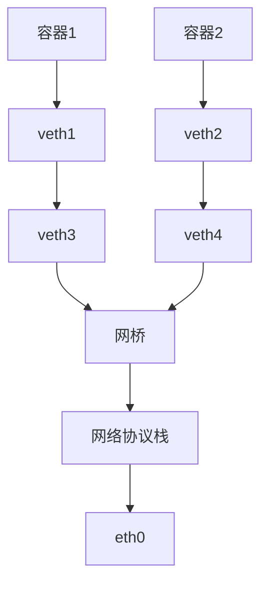

# CNI插件开发

cni接口文档

https://github.com/containernetworking/cni

Spec在这里

https://github.com/containernetworking/cni/blob/main/SPEC.md

已经写好的网络插件：

https://github.com/containernetworking/plugins

# 1. 使用shell写个最简单的插件、本地测试

## 1.1 环境配置

安装测试工具

```go
#新建一个空文件夹
mkdir cnitoolinstall
cd cnitoolinstall
go mod init cnitoolinstall
go get github.com/containernetworking/cni
go install github.com/containernetworking/cni/cnitool
```

## 1.2 参数

cni接口会传一些参数和环境变量给我们的二进制程序

Protocol parameters are passed to the plugins via OS environment variables.

- `CNI_COMMAND`: indicates the desired operation; `ADD`, `DEL`, `CHECK`, `GC`, or `VERSION`.
- `CNI_CONTAINERID`: Container ID. A unique plaintext identifier for a container, allocated by the runtime. Must not be empty. Must start with an alphanumeric character, optionally followed by any combination of one or more alphanumeric characters, underscore (), dot (.) or hyphen (-).
- `CNI_NETNS`: A reference to the container's "isolation domain". If using network namespaces, then a path to the network namespace (e.g. `/run/netns/[nsname]`)
- `CNI_IFNAME`: Name of the interface to create inside the container; if the plugin is unable to use this interface name it must return an error.
- `CNI_ARGS`: Extra arguments passed in by the user at invocation time. Alphanumeric key-value pairs separated by semicolons; for example, "FOO=BAR;ABC=123"
- `CNI_PATH`: List of paths to search for CNI plugin executables. Paths are separated by an OS-specific list separator; for example ':' on Linux and ';' on Windows

参数会通过环境变量传给插件

- `CNI_COMMAND`: 表示期望进行的操作：`ADD`、`DEL`、`CHECK`、`GC`和`VERSION`
- `CNI_CONTAINERID`: 容器ID，容器的唯一纯文本标识符
- `CNI_NETNS`: 对容器“隔离域”的引用。如果使用网络命名空间，则为网络命名空间的路径（例如/run/netns/[nsname]）
- `CNI_IFNAME`: 要在容器内创建的接口名称; 如果插件无法使用此接口名称，则它必须返回错误
- `CNI_ARGS`: 用户在调用时传入的额外参数。 以分号分隔的字母数字键值对； 例如，“FOO=BAR;ABC=123”
- `CNI_PATH`: 搜索 CNI 插件可执行文件的路径列表。 路径由操作系统特定的列表分隔符分隔； 例如 Linux 上的 ':' 和 ';' 在 Windows 上

## 1.3 hello world

可以写一个简单的脚本作为可执行程序，打印环境变量和stdin

```bash
#!/bin/bash
>&2 echo "mycmd:$CNI_COMMAND" #cni调用方是用过解析stdout的输出判断返回结果的，所以这里的打印都要放到stderr
>&2 echo "myid:$CNI_CONTAINERID"

#获取stdin输入的所有内容，cni调用方会从stdin传参
while read line
do
>&2 echo "$line"
done < "${1:-/dev/stdin}"

if [[ $CNI_COMMAND=="ADD" ]];then
	echo "{}" #输出返回结果，必须是json格式的
fi
```

## 1.4 部署插件

目录结构是这样的

```bash
❯ tree .
.
├── bin
│   └── mynet
└── conf
    └── 10-mynet.conf
```

bin中的mynet是cni的可执行程序，就是上面的shell脚本，记得`chmod +x` 一下 

配置文件放在conf中，注意type字段用于指定bin的可执行文件的名字

cniVersion必须是0.4.0，是有规范的

```bash
vim 10-mynet.conf
{
	"cniVersion": "0.4.0",
	"name": "test",
	"type": "mynet"
}
```

```bash
#为了不影响宿主机，新建一个网络命名空间
ip netns add testing
#使用cnitool测试
NETCONFPATH=./conf CNI_PATH=./bin cnitool add test /var/run/netns/testing
```

输出：

```bash
❯ sudo NETCONFPATH=./conf CNI_PATH=./bin cnitool add test /var/run/netns/testing 
mycmd:ADD
myid:cnitool-77383ca0a0715733ca6f
{
    "cniVersion": "0.4.0",
    "dns": {}
}
```

可以看到stdin中传过来的是配置，参数是环境变量传过来的

# 2. 用go实现cni插件

直接使用cni库来完成输入输出和参数处理这块

```bash
mkdir mycni
go mod init mycni
go get github.com/containernetworking/cni
```

代码，继续只做打印，用go代码还原上面shell的功能

```go
package main

import (
	"encoding/json"
	"fmt"
	"os"

	"github.com/containernetworking/cni/pkg/skel"
	"github.com/containernetworking/cni/pkg/types"
	types4 "github.com/containernetworking/cni/pkg/types/040"
	"github.com/containernetworking/cni/pkg/version"
)

func log(format string, a ...any) { //由于不能往stdout中打印，所以搞了个往stderr中打印的函数
	fmt.Fprintf(os.Stderr, format, a...)
}

func addHandler(args *skel.CmdArgs) error { //cni add的处理函数
	cfg, err := ConfigFromStdin(args.StdinData) //从stdin中获取配置, 可选
	if err != nil {
		return err
	}
	ret := types4.Result{ //注意看引用的类型040就是cniversion是0.4.0的，直接使用库给的返回result的方法
		CNIVersion: cfg.CNIVersion,
	}
	return ret.Print()
}

type Config struct {
	types.NetConf
	MyAge int `json:"age"`
}

func ConfigFromStdin(data []byte) (*Config, error) {
	cfg := &Config{}
	err := json.Unmarshal(data, cfg)
	if err != nil {
		return nil, err
	} else {
		return cfg, nil
	}
}

func main() {
	log("调用了mycni插件\n")
	skel.PluginMain(addHandler, nil, nil, version.All, "")
}
```

仍然创建bin和conf目录

conf中写

```bash
vim 10-mynet.conf
{
	"cniVersion": "0.4.0",
	"name": "mycni",
	"type": "mycni-bin"
}
```

写个Makefile方便一些

```makefile
all:
	go build -o bin/mycni-bin main.go

test:
	sudo NETCONFPATH=./conf CNI_PATH=./bin cnitool add mycni /var/run/netns/testing
```

这样的话

编译：make

测试：make test

```bash
❯ make test
sudo NETCONFPATH=./conf CNI_PATH=./bin cnitool add mycni /var/run/netns/testing
调用了mycni插件
{
    "cniVersion": "0.4.0",
    "dns": {}
}%
```

# 3. 利用cni插件创建网桥

利用netlink库来创建

```bash
go get github.com/vishvananda/netlink
```

我们需要创建出这样的结构



## 3.1 host-local插件学习

`host-local`是一个内置的插件，安了k8s就有

文档在https://www.cni.dev/plugins/current/ipam/host-local/

`host-local` IPAM插件从一组地址范围中分配IP地址。它将状态本地存储在主机文件系统上，从而确保单个主机上IP地址的唯一性。

可以用`cnitool`来单独测试`host-local`

需要写一个配置文件

叫做10-test.conf

```json
{
    "cniVersion": "0.4.0",
    "name": "mynet",
    "ipam": {
		"type": "host-local",
		"ranges": [
			[
				{
					"subnet": "10.16.0.0/16"
				}
			]
		],
		"dataDir": "/tmp/cni-host"
	}
}
```

也可以直接用环境变量和stdin传参来测试

```json
CNI_COMMAND=ADD CNI_CONTAINERID=cc1 CNI_NETNS=/var/run/netns/testing \
CNI_IFNAME=eth10 CNI_PATH=./bin ./bin/host-local < ./testconf/10-test.conf
```

在我们的代码中，我把服务器的host-local拷贝到bin了

并且在Makefile中加了上面那段测试shell

```json
❯ make hostlocal             
sudo CNI_COMMAND=ADD CNI_CONTAINERID=cc1 CNI_NETNS=/var/run/netns/testing CNI_IFNAME=eth10 CNI_PATH=./bin ./bin/host-local < ./testconf/10-test.conf
{
    "cniVersion": "0.4.0",
    "ips": [
        {
            "version": "4",
            "address": "10.16.0.2/16",
            "gateway": "10.16.0.1"
        }
    ],
    "dns": {}
}%
```

可以看到分配了"address": "10.16.0.2/16"

如果把容器IP从cc1改为cc2，再运行一遍，就会分配10.16.0.3/16，如果不改就会报错说地址冲突

## 3.2 在我们的cni插件中嵌入host-local

我们的cni插件需要使用host-local提供的ipam能力，该如何在代码中调用host-local？

### 3.2.1 添加依赖

添加import

```json
"github.com/containernetworking/plugins/pkg/ipam"
```

然后`go mod tidy`一下

### 3.2.2 添加配置

需要把ipam的配置一并写入.conf中，此外我这里还添加了一个自定义配置bridge

`10-my-net.conf`

```json
{
	"cniVersion": "0.4.0",
	"name": "mycni",
	"type": "mycni-bin",
    "bridge": "wyw0",
    "ipam": {
		"type": "host-local",
		"ranges": [
			[
				{
					"subnet": "10.16.0.0/16"
				}
			]
		],
		"dataDir": "/tmp/cni-host"
	}
}
```

### 3.2.3 代码调用

在上面的示例中添加如下代码

```go
func addHandler(args *skel.CmdArgs) error {
	...
	if cfg.IPAM.Type != "" {
		r, err := ipam.ExecAdd(cfg.IPAM.Type, args.StdinData) //执行host-local
		if err != nil {
			return err
		}
		ipamRet, err := types4.NewResultFromResult(r) //解析result
		if err != nil {
			return err
		}
		ret.IPs = ipamRet.IPs //传给上下文
		ret.DNS = ipamRet.DNS
	}
	fmt.Println(ret.Ips)
	...
}
```

查看netns

```json
ip netns list
```

## 4. 用代码创建网桥和Veth设备

```go
// 创建或更新网桥
func CreateOrUpdateBridge(br string, br_addr string) (*netlink.Bridge, error) {
	link, err := netlink.LinkByName(br)
	if err != nil {
		if _, ok := err.(netlink.LinkNotFoundError); ok {
			br := &netlink.Bridge{
				LinkAttrs: netlink.LinkAttrs{
					Name: br,
					MTU:  1500,
				},
			}
			if err := netlink.LinkAdd(br); err != nil {
				return nil, err
			}
			var addr *netlink.Addr
			if addr, err = netlink.ParseAddr(br_addr); err != nil {
				return nil, err
			}
			if err = netlink.AddrAdd(br, addr); err != nil { //设置ip
				return nil, err
			}
			if err = netlink.LinkSetUp(br); err != nil { //把网桥设为UP
				return nil, err
			}
			return br, nil
		} else {
			return nil, err
		}
	}
	if br, ok := link.(*netlink.Bridge); ok {
		return br, nil
	}
	return nil, fmt.Errorf("错误的网桥对象")
}

// 创建veth设备
func CreateVeth(nspath string, addrstr string, br *netlink.Bridge) error {
	var veth_host, veth_container = RandomVethName(), RandomVethName()
	vethpeer := &netlink.Veth{
		LinkAttrs: netlink.LinkAttrs{
			Name: veth_host,
			MTU:  1500,
		},
		PeerName: veth_container,
	}
	err := netlink.LinkAdd(vethpeer)
	if err != nil {
		return err
	}

	veth_host_interface, err := netlink.LinkByName(veth_host)
	if err != nil {
		return err
	}
	err = netlink.LinkSetMaster(veth_host_interface, br)
	if err != nil {
		return err
	}
	err = netlink.LinkSetUp(veth_host_interface)
	if err != nil {
		return err
	}

	ns, err := netns.GetFromPath(nspath)
	if err != nil {
		return err
	}
	defer ns.Close()
	veth_container_interface, err := netlink.LinkByName(veth_container)
	if err != nil {
		return err
	}
	err = netlink.LinkSetNsFd(veth_container_interface, int(ns))
	if err != nil {
		return err
	}
	err = netns.Set(ns) //进入这个ns进行操作
	if err != nil {
		return err
	}
	veth_container_interface, err = netlink.LinkByName(veth_container)
	if err != nil {
		return err
	}
	addr, _ := netlink.ParseAddr(addrstr)
	err = netlink.AddrAdd(veth_container_interface, addr)
	if err != nil {
		return err
	}
	err = netlink.LinkSetName(veth_container_interface, "eth0") //把容器内的veth名字设为eth0
	if err != nil {
		return err
	}
	err = netlink.LinkSetUp(veth_container_interface)
	if err != nil {
		return err
	}
	return AddRoute()
}
```

## 5. 容器和宿主机网络互通

目前容器和宿主及网络不同，根本原因是容器内路由不正确，容器内只有同网段的才会进入eth0设备

可以查看testing命名空间的路由表

```json
❯ sudo ip netns exec testing route -n                                
Kernel IP routing table
Destination     Gateway         Genmask         Flags Metric Ref    Use Iface
10.16.0.0       0.0.0.0         255.255.0.0     U     0      0        0 eth0
```

需要执行如下命令让所有的流量都进入10.16.0.1的网关

```bash
ip netns exec testing route add default via 10.16.0.1 dev eth0
```

用代码实现就是

```go
func AddRoute() error {
	route := &netlink.Route{
		Dst: &net.IPNet{
			IP:   net.IPv4(0, 0, 0, 0),
			Mask: net.IPv4Mask(0, 0, 0, 0),
		},
		Gw: net.IPv4(10, 16, 0, 1),
	}
	return netlink.RouteAdd(route)
}
```

测试执行

```go
sudo ip netns exec testing ping 10.11.13.97
PING 10.11.13.97 (10.11.13.97) 56(84) bytes of data.
64 bytes from 10.11.13.97: icmp_seq=1 ttl=64 time=0.078 ms
```

能够连通主机网络
