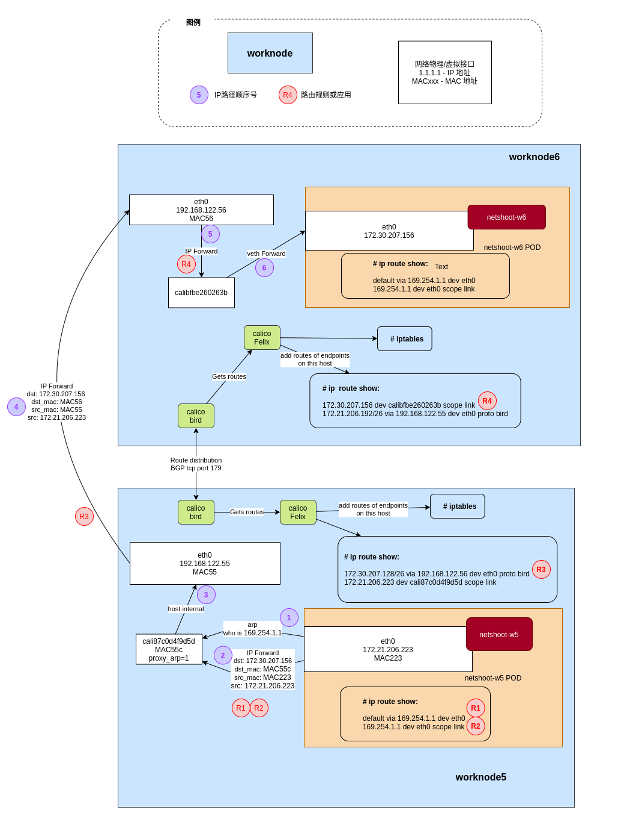
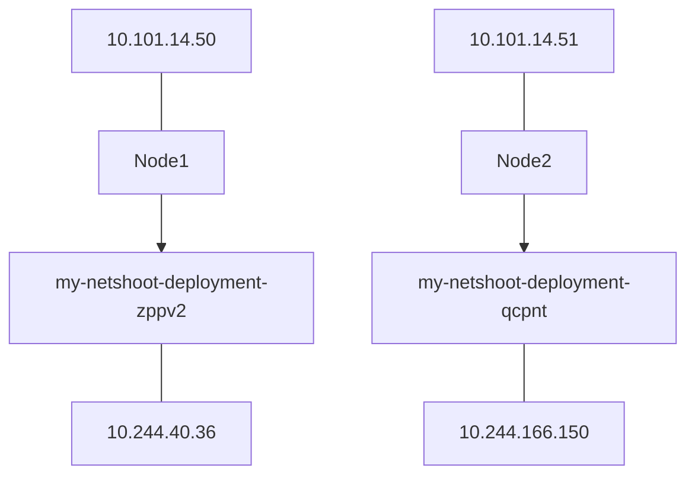
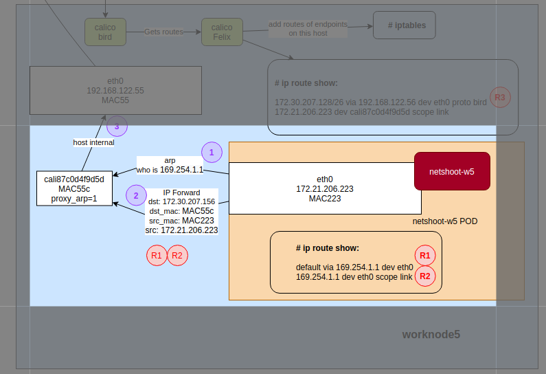
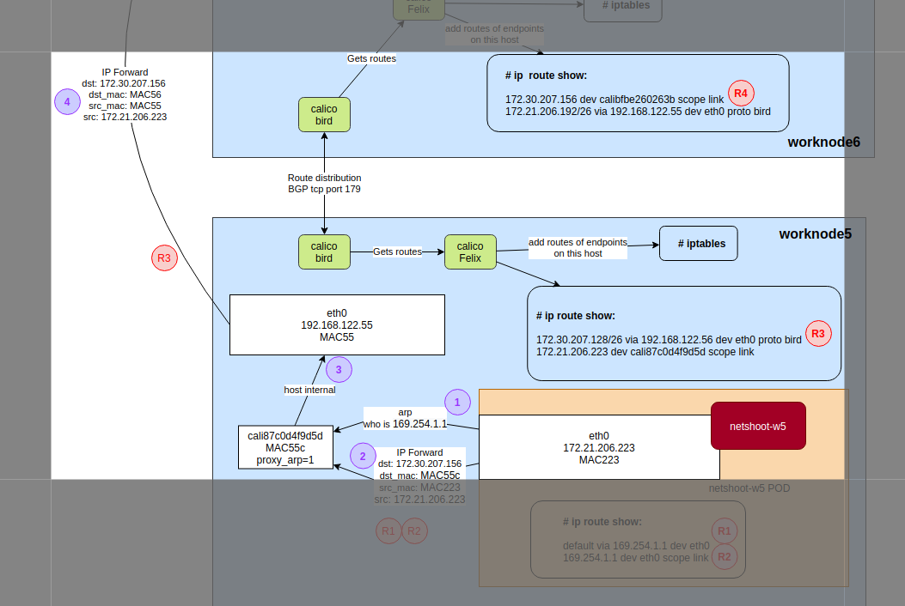
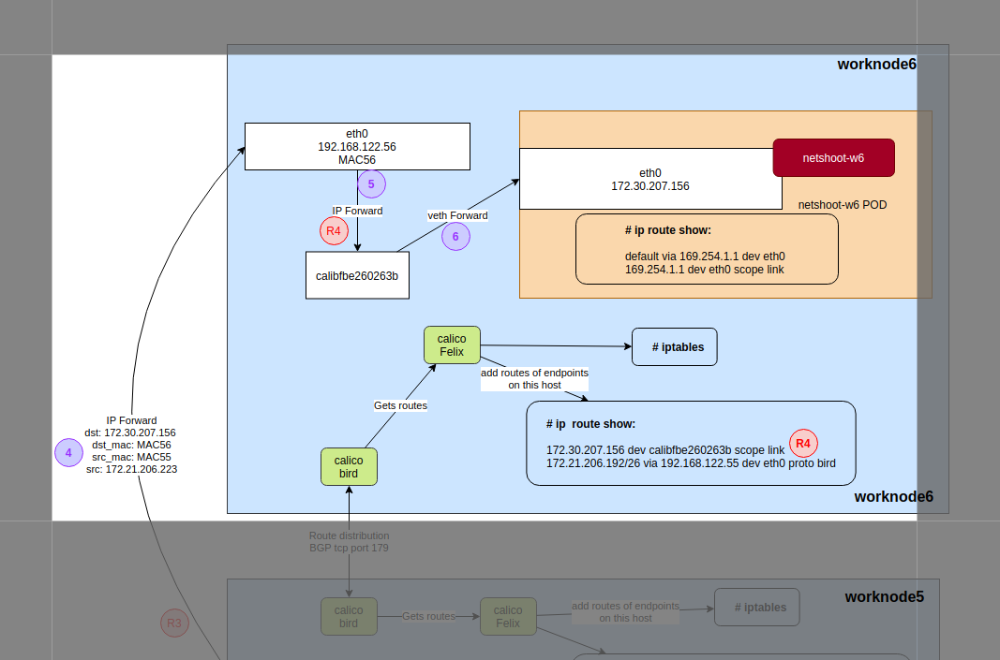

# Calico Pod to Pod数据路径

引自https://blog.mygraphql.com/zh/notes/cloud/calico/



对于我的机器来说，我搞了一个两节点的k8s集群，安装好了calico。并在两台机器上分别部署了测试用的pod

```yaml
apiVersion: apps/v1
kind: DaemonSet
metadata:
  name: my-netshoot-deployment
spec:
  selector:
    matchLabels:
      app: my-netshoot
  template:
    metadata:
      labels:
        app: my-netshoot
    spec:
      containers:
      - name: netshoot
        image: docker.io/nicolaka/netshoot:latest
        ports:
        - containerPort: 80
---
apiVersion: v1
kind: Service
metadata:
  name: my-netshoot-service
spec:
  selector:
    app: my-netshoot
  ports:
    - protocol: TCP
      port: 80
      targetPort: 80
  type: ClusterIP
```

架构如下



本文只关注pod ip to pod ip

此外k8s网络至少还有pod to cluster ip

node to pod ip

node to cluster ip 等

下面**分析从my-netshoot-deployment-zppv2的流量是如何走到my-netshoot-deployment-qcpnt的**

# 步骤1&2



1. 首先my-netshoot-deployment-zppv2(10.244.40.36)想要建立到my-netshoot-deployment-qcpnt（10.244.166.150）的连接，那么就会发送TCP SYN包
2. 这个SYN包会直接发送给主机namespace中的veth设备对，为什么？要去容器中看路由表，这里提供一个跟原文不一样的方法，因为有些容器中是没有ip、route这些命令的
    
    ```bash
    #获取pod对应的docker的containerID
    > kubectl get po my-netshoot-deployment-zppv2 -o yaml | grep containerID
    - containerID: docker://2a14c46f42a1110fd005e9c1a4dca0f265c9f7dbf8fc982ce04a1f4262710467
    
    #查看docker进程id
    > docker inspect 2a14c46f42a1110fd005e9c1a4dca0f265c9f7dbf8fc982ce04a1f4262710467 | grep Pid
    "Pid": 11314,
    
    #进入容器命名空间
    > nsenter -t 11314 -n
    
    #查看路由表R1
    > ip r
    **default via 169.254.1.1 dev eth0 
    169.254.1.1 dev eth0 scope link**
    ```
    
3. 此时，内核的路由层解释路由表R1，发现default的，也就是所有的包都应该发送给169.254.1.1网关。但它不知道169.254.1.1的MAC地址是多少。（这个奇怪的路由实际是不存在的，是Calico造出来的），有关169.254.1.1的说明在https://docs.projectcalico.org/reference/faq#why-does-my-container-have-a-route-to-16925411
4. 但是看路由表R1的第二条规则，可知169.254.1.1是本地LAN L2层可达的
5. 路由层就会发送ARP查询包，`who is 169.254.1.1`
6. 主机空间的veth设备对会直接回复这条ARP请求，并返回自己的MAC地址，这个MAC地址其实不重要，并且被Calico配置成了`EE:EE:EE:EE:EE:EE`
    
    ```bash
    #还是在容器命名空间查看网络设备
    > ip a
    1: lo: <LOOPBACK,UP,LOWER_UP> mtu 65536 qdisc noqueue state UNKNOWN group default qlen 1000
        link/loopback 00:00:00:00:00:00 brd 00:00:00:00:00:00
        inet 127.0.0.1/8 scope host lo
           valid_lft forever preferred_lft forever
    2: tunl0@NONE: <NOARP> mtu 1480 qdisc noop state DOWN group default qlen 1000
        link/ipip 0.0.0.0 brd 0.0.0.0
    4: eth0@if507: <BROADCAST,MULTICAST,UP,LOWER_UP> mtu 1480 qdisc noqueue state UP group default 
        link/ether 86:79:13:2b:26:1d brd ff:ff:ff:ff:ff:ff link-netnsid 0
        inet 10.244.40.36/32 scope global eth0
           valid_lft forever preferred_lft forever
    
    #eth0就是设备对的一端，注意看eth0后面的@if507,这个是Interface Index
    #另一端会有相同的Index
    #所以去主机命名空间查看对应的网络设备
    > ip a | grep 507 -A 4
    507: cali0f293e89ca7@if4: <BROADCAST,MULTICAST,UP,LOWER_UP> mtu 1480 qdisc noqueue state UP group default 
        link/ether ee:ee:ee:ee:ee:ee brd ff:ff:ff:ff:ff:ff link-netnsid 17
        inet6 fe80::ecee:eeff:feee:eeee/64 scope link 
           valid_lft forever preferred_lft forever
    #可以看到veth设备的MAC地址是ee:ee:ee:ee:ee:ee
    ```
    
    但是为什么veth设备会直接回复ARP请求自己的MAC地址呢？它自己的IP又不是`169.254.1.1` 。为什么不会继续广播去问这个IP呢？
    
    这里使用了一个linux特性叫`proxy_arp`
    
    ```bash
    #查看主机空间cali0f293e89ca7的proxy_arp策略
    > cat /proc/sys/net/ipv4/conf/cali0f293e89ca7/proxy_arp
    1
    ```
    
    可以看到确实启用了`proxy_arp`
    
    `proxy_arp`的更多说明在https://www.dasblinkenlichten.com/getting-started-with-calico-on-kubernetes/
    
    如果启用了`proxy_arp`当一个设备满足以下两个条件时，就会直接给ARP请求返回自己的MAC地址
    
    1. 主机知道目的地址
    2. 主机接收ARP请求的设备，和主机去到达目的地址的设备不同
    
    对于本例来说10.101.14.50（Node1）知道10.101.14.51 （Node2），并且接收ARP请求的设备是cali0f293e89ca7，而到达目的地址的设备是物理网卡bond0（对于我的机器来说），所以会直接回复自己的MAC地址
    
    ```bash
    #可以测试一下，这里没有再进入容器命名空间，而是直接在容器内执行命令，因为我本机没装arping
    #我这里arping了目标pod地址，可以看到回复确实是EE:EE:EE:EE:EE:EE
    > kubectl exec my-netshoot-deployment-zppv2  arping  10.244.166.150 
    ARPING 10.244.166.150 from 10.244.40.36 eth0
    Unicast reply from 10.244.166.150 [EE:EE:EE:EE:EE:EE]  0.540ms
    Unicast reply from 10.244.166.150 [EE:EE:EE:EE:EE:EE]  0.529ms
    Unicast reply from 10.244.166.150 [EE:EE:EE:EE:EE:EE]  0.531ms
    Unicast reply from 10.244.166.150 [EE:EE:EE:EE:EE:EE]  0.527ms
    
    #
    > kubectl exec my-netshoot-deployment-zppv2  ip route get 10.244.166.150 
    kubectl exec [POD] [COMMAND] is DEPRECATED and will be removed in a future version. Use kubectl exec [POD] -- [COMMAND] instead.
    10.244.166.150 via 169.254.1.1 dev eth0 src 10.244.40.36 uid 0
    #可见包从eth0设备发送给了169.254.1.1网关，相当于veth设备接收了所有的容器内出来的网络包
    ```
    
    所以，第一步，网络包被发送给了cali0f293e89ca7设备
    
    此时，包的信息是这样的
    
    ```bash
    Dst: 10.244.166.150
    DstMac: ee:ee:ee:ee:ee:ee
    Src: 10.244.40.36
    SrcMac: 容器的MAC地址
    ```
    
    # 步骤3&4
    
    
    
    1. cali0f293e89ca7收到包，内核发现目标地址10.244.166.150不是本机，所以会交由IP Forward策略处理。
    2. IP Forward会查看路由表，决定包会转发到哪里
        
        ```bash
        #查看本机路由
        > ip r                                                          
        default via 10.101.14.62 dev bond0 proto static 
        10.101.14.48/28 dev bond0 proto kernel scope link src 10.101.14.50 
        blackhole 10.244.40.0/26 proto bird 
        10.244.40.1 dev calife2afe74a4e scope link 
        10.244.40.2 dev cali826c960875a scope link 
        **10.244.166.128/26 via 10.101.14.51 dev tunl0 proto bird onlink** 
        172.17.0.0/16 dev docker0 proto kernel scope link src 172.17.0.1
        ```
        
        可以看到有一条10.22.166.128/26都会被发送到10.101.14.51（即Node2的IP），这条规则是Calico通过bird组件，通过BGP协议创建的。
        
    3. 此时Node1可能还不知道Node2的MAC地址，所以可能会发送arp请求：`who is 10.101.14.51` ，然后由Node2正常返回自己的MAC地址
    4. 然后包会从tunl0发送到Node2，有些人这里可能不是tunl0，是eth0（即物理网卡）。我这里是tunl0是因为我打开了IPIP隧道模式
        
        配置是写在calico的Daemonset的环境变量中。可以这样查看`kubectl get po -n kube-system calico-node-9gs88 -o yaml | grep IPIP -C 6`
        
    

# 步骤5&6



1. Node2通过隧道收到包后，包会到到eth0网卡，并进入内核态，发现本机IP不是目标10.244.166.150。所以会进入IP Forward策略。
2. 首先又会查看路由表，我们去Node2上面查看路由表
    
    ```bash
    > ip r
    default via 10.101.14.62 dev bond0 proto static 
    10.101.14.48/28 dev bond0 proto kernel scope link src 10.101.14.51 
    10.244.40.0/26 via 10.101.14.50 dev tunl0 proto bird onlink 
    blackhole 10.244.166.128/26 proto bird 
    10.244.166.129 dev cali4c6ad0d72eb scope link 
    10.244.166.142 dev calie65e23fd4f1 scope link 
    **10.244.166.150 dev cali939c278cb2e scope link** 
    172.17.0.0/16 dev docker0 proto kernel scope link src 172.17.0.1 linkdown 
    172.30.0.0/16 dev br-bcc86535bdb2 proto kernel scope link src 172.30.0.1
    ```
    
    发现目标IP会被路由到cali939c278cb2e设备，这个设备就是目标pod的veth设备。可以确认一下
    
    ```bash
    # host命名空间查看设备的ID
    > ip -d link show cali939c278cb2e
    749: cali939c278cb2e@if4: <BROADCAST,MULTICAST,UP,LOWER_UP> mtu 1480 qdisc noqueue state UP mode DEFAULT group default 
        link/ether ee:ee:ee:ee:ee:ee brd ff:ff:ff:ff:ff:ff link-netnsid 22 promiscuity 0 
        veth addrgenmode eui64 numtxqueues 1 numrxqueues 1 gso_max_size 65536 gso_max_segs 65535
    
    # 进入容器命名空间
    > ip a
    4: eth0@if749: <BROADCAST,MULTICAST,UP,LOWER_UP> mtu 1480 qdisc noqueue state UP group default 
        link/ether fe:c9:54:f8:80:16 brd ff:ff:ff:ff:ff:ff link-netnsid 0
        inet 10.244.166.150/32 scope global eth0
           valid_lft forever preferred_lft forever
    #可以看到4和749是对应的
    ```
    
3. 至此ACK包就路由到了对端Pod